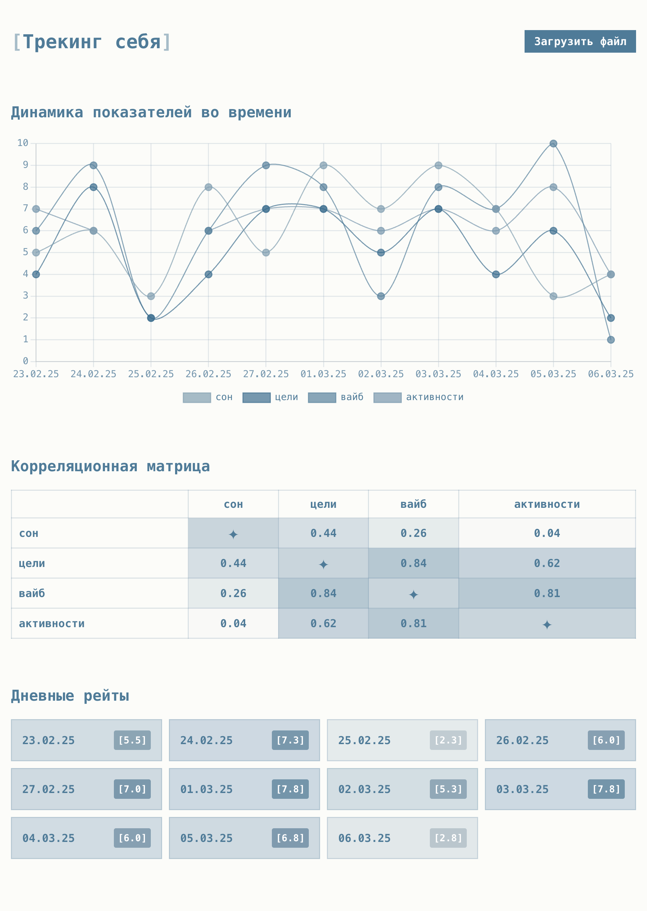

# [Трекинг себя]

Аналитическая приложуха для отслеживания и визуализации личных метрик для выявления корреляций и паттернов ✦

> _То, что измеримо, то и управляемо._



## Основные функции

-  **Временные ряды**: Визуализация динамики всех отслеживаемых метрик на графе
-  **Корреляции**: Матрица корреляций между различными показателями для выявления взаимосвязей
-  **Дневные оценки**: Карточки со средним баллом за день
-  **Загрузка данных**: Поддержка .md файлов со структурированными записями

## Формат входных данных (.md)

```md
05.03.25

-  **сон** → текст... (3) - это оценка по шкале от 1 до 10
-  **цели** → текст... (6)
-  **вайб** → текст... (10)
-  **активности** → текст... (8)

## 06.03.25

-  **сон** → текст... (4)
-  **цели** → текст... (2)
-  **вайб** → текст... (1)
-  **активности** → текст... (4)
```

## Приятного самотрекинга!

Запуск через `npm install` и `npm start`

Или же онлайн-версия: [трекинг себя](https://self-tracker.netlify.app/)
